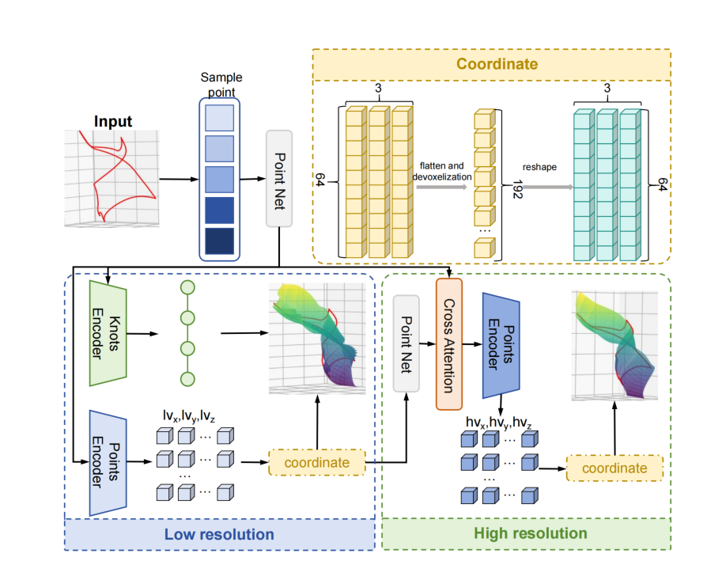

# UV Transformers (UVTran) 
Pytorch code for paper "**UVTran: Accurate Hole-Filling Parameterization with Transformers**"




### 1. Dataset Generation 

```
tar -zxvf 1wcurve.tar.gz

cd datagen
python g1.py
```

### 2. Requirements

Install requirements:
```
pip install -r requirements.txt
```

### 3. Training

**UVTran*

```
python trainpre.py --batch_size 128 --lr 1e-4


python trainrefine.py  --batch_size 128 --lr 1e-4
```


### 5. Testing

**Test a model on dataset by**

```
python test.py 
```
```
